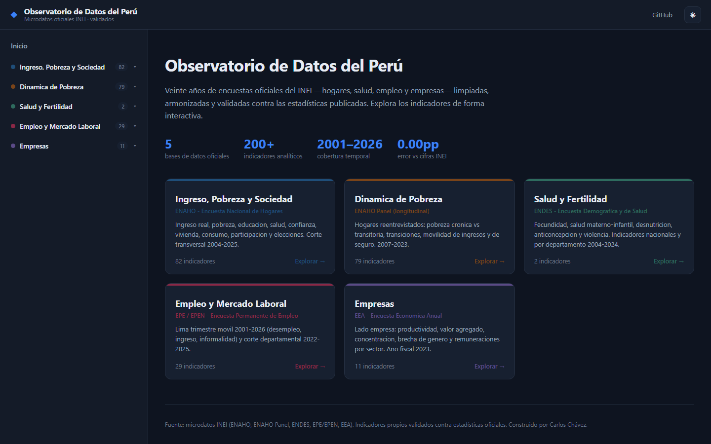

# Observatorio de Datos del Perú

Aplicación web **dinámica** para explorar 20 años de encuestas oficiales del INEI
—ENAHO, ENAHO Panel, ENDES, EPE/EPEN y EEA— limpiadas, armonizadas y validadas
contra las estadísticas publicadas. Backend con consultas en vivo, frontend con
gráficos interactivos, organizado en **5 secciones (una por base de datos)**.



## Arquitectura

```
  data/datasets/*.csv   203 tablas analíticas (agregados, sin microdatos)
        │  data/build_db.py
        ▼
  observatorio.duckdb    5 esquemas: enaho · panel · endes · epen · eea
        │  backend/  (FastAPI, consultas parametrizadas y seguras)
        ▼
  /api/...               catálogo, datos con filtros dinámicos, descarga CSV
        │  frontend/  (React + Vite + ECharts)
        ▼
  SPA interactiva        navegación por base → tema → indicador; gráficos en vivo
```

Un solo servicio: FastAPI sirve la API **y** el frontend construido.

## Secciones (bases de datos)

| Sección | Fuente | Contenido |
|---|---|---|
| Ingreso, Pobreza y Sociedad | ENAHO | ingreso real, pobreza, educación, salud, confianza, vivienda, consumo, elecciones |
| Dinámica de Pobreza | ENAHO Panel | pobreza crónica vs transitoria, transiciones, movilidad |
| Salud y Fertilidad | ENDES | fecundidad, salud materno-infantil, desnutrición, anticoncepción |
| Empleo y Mercado Laboral | EPE/EPEN | Lima trimestre móvil 2001-2026, corte departamental |
| Empresas | EEA | productividad, valor agregado, concentración, brechas |

## Desarrollo local

Requiere Python 3.11+ y Node 18+.

```bash
# 1. construir la base de datos (desde D:\ENAHO_ANALYSIS\datasets, o desde
#    los CSV ya incluidos en data/datasets si esa ruta no existe)
cd data && python build_db.py && cd ..

# 2. backend (API en :8077)
cd backend && uvicorn main:app --reload --port 8077

# 3. frontend (dev server en :5199, con proxy al backend)
cd frontend && npm install && npm run dev
```

Para producción local: `cd frontend && npm run build`, luego levanta solo el
backend (sirve `frontend/dist` en `/`).

## Despliegue (gratis, dinámico)

El repo trae `Dockerfile` (construye frontend + backend en un contenedor) y
`render.yaml`.

- **Render**: New → Blueprint → apunta a este repo. Plan free. `/api/health`
  como health check.
- **Hugging Face Spaces**: crear un Space tipo *Docker*, subir el repo. Usa el
  mismo `Dockerfile`.
- **Railway / Fly.io**: detectan el `Dockerfile` automáticamente.

## Datos

Los CSV en `data/datasets/` son **agregados analíticos** (series, cortes,
indicadores) derivados de los microdatos INEI y validados contra cifras
oficiales. Los microdatos individuales (ENDES mujeres/nacimientos/miembros) se
excluyen a propósito: son grandes y no son insumo directo de gráficos.

Fuente: microdatos INEI. Indicadores propios. Construido por Carlos Chávez.
